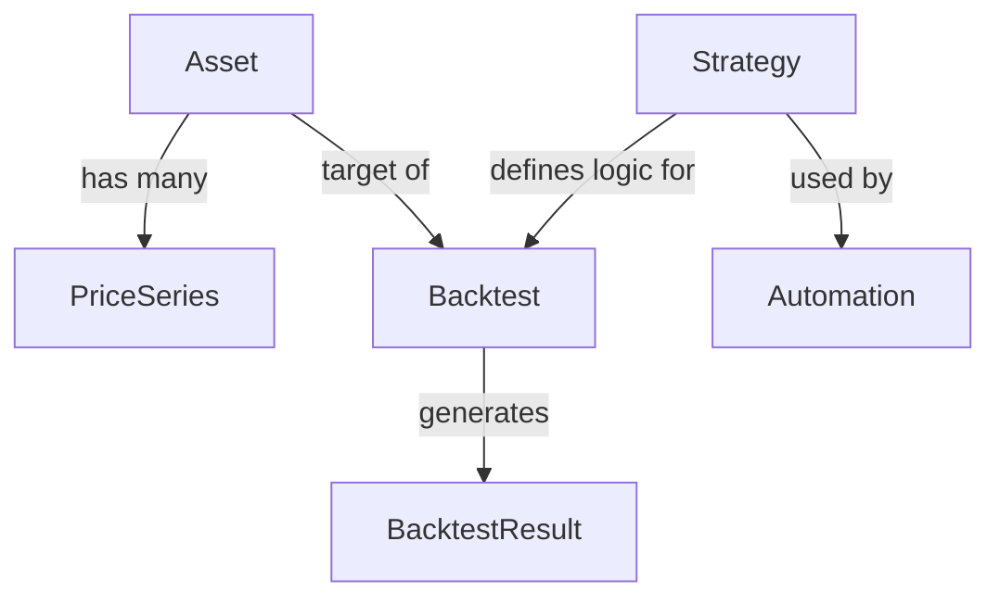

# API Design Document: Awesome CLI

## Resources & Requirements for awesome_cli

The following core resources are identified for the crypto trading and analytics platform.

### Core Resources

*   **Asset**
    *   **Purpose:** Represents a tradable instrument (e.g., BTC, ETH).
    *   **Fields:** `symbol` (PK), `name`, `type` (crypto, fiat), `active`.
    *   **Operations:** Read-only (synced from exchanges).

*   **PriceSeries**
    *   **Purpose:** Historical or simulated market data (OHLCV).
    *   **Fields:** `asset_id`, `interval` (1m, 1h, 1d), `timestamp`, `open`, `high`, `low`, `close`, `volume`.
    *   **Relationships:** `/assets/{symbol}/price-series`
    *   **Operations:** Read-only analytics (potentially massive datasets).

*   **Strategy**
    *   **Purpose:** Definition of a trading logic/algorithm.
    *   **Fields:** `id`, `name`, `description`, `code_ref` (class path), `default_parameters` (JSON).
    *   **Operations:** CRUD.

*   **Backtest**
    *   **Purpose:** An execution of a *Strategy* over a specific *PriceSeries*.
    *   **Fields:** `id`, `strategy_id`, `asset_id`, `start_date`, `end_date`, `initial_capital`, `parameters` (JSON override), `status` (running, completed, failed).
    *   **Relationships:** `/strategies/{id}/backtests`
    *   **Operations:** Create (execute), Read (monitor).

*   **BacktestResult (Metrics & Ledger)**
    *   **Purpose:** The output of a backtest.
    *   **Fields:**
        *   *Metrics:* `total_return`, `sharpe_ratio`, `max_drawdown`, `win_rate`.
        *   *Ledger:* List of trades (buy/sell, price, timestamp, profit).
    *   **Relationships:** `/backtests/{id}/metrics`, `/backtests/{id}/ledger`

*   **Automation**
    *   **Purpose:** A scheduled or live runner for a strategy.
    *   **Fields:** `id`, `strategy_id`, `schedule` (cron), `status` (active, paused).
    *   **Operations:** CRUD, Pause/Resume.

### Relationship Map



---

## REST API Design

Base Path: `/api/v1/`

### 1. Assets & Market Data

*   **GET /api/v1/assets**
    *   *Purpose:* List supported assets.
    *   *Query:* `?search=BTC`
*   **GET /api/v1/assets/{symbol}**
    *   *Purpose:* Get asset details.
*   **GET /api/v1/assets/{symbol}/price-series**
    *   *Purpose:* Fetch OHLCV data.
    *   *Query:* `?start=2023-01-01&end=2023-02-01&interval=1d`
    *   *Response:* List of OHLC objects.

### 2. Strategies

*   **GET /api/v1/strategies**
    *   *Purpose:* List available strategies.
*   **POST /api/v1/strategies**
    *   *Purpose:* Register a new strategy definition.
    *   *Body:* `{ "name": "GoldenCross", "code_ref": "core.strategies.GoldenCross", "default_parameters": { "short": 50, "long": 200 } }`
*   **GET /api/v1/strategies/{id}**

### 3. Backtests

*   **POST /api/v1/backtests**
    *   *Purpose:* Run a backtest.
    *   *Body:*
        ```json
        {
          "strategy_id": "golden-cross",
          "asset_symbol": "BTC",
          "start_date": "2023-01-01",
          "end_date": "2023-12-31",
          "parameters": { "short_window": 40 }
        }
        ```
*   **GET /api/v1/backtests**
    *   *Query:* `?strategy_id=...&status=completed`
*   **GET /api/v1/backtests/{id}**
    *   *Purpose:* Get status and summary.
*   **GET /api/v1/backtests/{id}/metrics**
    *   *Purpose:* Get calculated performance metrics.
*   **GET /api/v1/backtests/{id}/ledger**
    *   *Purpose:* Get the trade history.
    *   *Query:* `?page=1`

### 4. Automation

*   **POST /api/v1/automations**
    *   *Body:* `{ "strategy_id": "...", "cron": "0 0 * * *", "active": true }`
*   **PATCH /api/v1/automations/{id}**
    *   *Purpose:* Enable/Disable.

### Response Envelope

We utilize the existing `StandardResponseRenderer` to ensure consistency:

```json
{
  "data": { ... },
  "meta": { "total": 10, "page": 1, "limit": 20 },
  "errors": []
}
```

---

## Proactive Design Decisions

*   **Versioning:**
    *   Prefix `/api/v1/` is strictly enforced.
    *   Breaking changes (e.g., changing `ledger` format) require `/api/v2/`.
*   **Performance:**
    *   **Streaming/Pagination:** `price-series` and `ledger` endpoints can return thousands of rows. We default to `PageNumberPagination` but will evaluate `CursorPagination` for these time-series endpoints to ensure stable iteration during ingestion.
    *   **Caching:** `Assets` and `Strategies` are highly cacheable (1 hour+).
*   **Flexibility:**
    *   **Parameters:** Strategy parameters are stored as a JSONField to allow generic strategies (Golden Cross vs Mean Reversion) without schema migrations.
    *   **Fields Selection:** (Future) `?fields=` support for heavy payloads.
*   **GraphQL Roadmap:**
    *   The Domain Model (Asset, Strategy, Backtest) maps 1:1 to GraphQL Types.
    *   Complex queries like "Show me all Backtests for BTC where Sharpe Ratio > 2" are better suited for GraphQL in the future.

---

## Security & Auth

*   **Authentication:**
    *   **API Clients:** Token-based (Header: `Authorization: Token <key>`).
    *   **Web UI:** Session-based (HttpOnly Cookies).
*   **Authorization:**
    *   Resources (Backtests, Automations, Portfolios) are **User-Scoped**. Users can only see their own runs.
    *   `Assets` and `PriceSeries` are **Public/Read-Only** (or subscribed).
*   **Safety Boundaries:**
    *   **Simulation vs Live:** Explicit separate endpoints or flags are not used; instead, `Automation` implies potential live action (future), while `Backtest` is strictly historical.
    *   **Live Trading Protection:** (Future) Require 2FA or distinct API keys with "Trade" scope.
*   **Rate Limiting:**
    *   Strict limits on `POST /backtests` (CPU intensive).

---

## Implementation Blueprint (Python/Django)

We recommend using **Django REST Framework (DRF)** as it is already integrated and robust for complex data models.

### Models (`src/web_project/inventory/models.py` -> `src/web_project/backtest/models.py`)

```python
from django.db import models

class Asset(models.Model):
    symbol = models.CharField(max_length=10, primary_key=True)
    name = models.CharField(max_length=100)

class Strategy(models.Model):
    name = models.CharField(max_length=100)
    code_ref = models.CharField(max_length=200) # e.g., "awesome_cli.strategies.GoldenCross"

class Backtest(models.Model):
    user = models.ForeignKey('auth.User', on_delete=models.CASCADE)
    strategy = models.ForeignKey(Strategy, on_delete=models.CASCADE)
    asset = models.ForeignKey(Asset, on_delete=models.CASCADE)
    parameters = models.JSONField(default=dict)
    status = models.CharField(max_length=20, default='pending')
    created_at = models.DateTimeField(auto_now_add=True)

    # Results stored directly or referenced
    metrics = models.JSONField(null=True)
```

### Serializers

```python
from rest_framework import serializers
from .models import Backtest

class BacktestRequestSerializer(serializers.ModelSerializer):
    class Meta:
        model = Backtest
        fields = ['strategy', 'asset', 'parameters', 'start_date', 'end_date']

class BacktestResponseSerializer(serializers.ModelSerializer):
    metrics = serializers.DictField(read_only=True)
    class Meta:
        model = Backtest
        fields = '__all__'
```

### Views (`api_views.py`)

```python
from rest_framework import viewsets, status
from rest_framework.decorators import action
from rest_framework.response import Response
from awesome_cli.core import services # Hypothetical core service

class BacktestViewSet(viewsets.ModelViewSet):
    queryset = Backtest.objects.all()
    serializer_class = BacktestResponseSerializer

    def get_queryset(self):
        return self.queryset.filter(user=self.request.user)

    def create(self, request, *args, **kwargs):
        serializer = BacktestRequestSerializer(data=request.data)
        serializer.is_valid(raise_exception=True)

        # Save 'pending' backtest record
        backtest = serializer.save(user=request.user)

        # Trigger async job (Celery/Queue) or Sync for now
        try:
            results = services.run_backtest(
                strategy=backtest.strategy.code_ref,
                asset=backtest.asset.symbol,
                params=backtest.parameters
            )
            backtest.metrics = results.metrics
            backtest.status = 'completed'
            backtest.save()
        except Exception as e:
            backtest.status = 'failed'
            backtest.save()

        return Response(BacktestResponseSerializer(backtest).data, status=status.HTTP_201_CREATED)
```

---

## OpenAPI & Documentation

Example OpenAPI Snippet for `POST /api/v1/backtests`:

```yaml
paths:
  /api/v1/backtests:
    post:
      summary: Run a trading strategy backtest
      security:
        - bearerAuth: []
      requestBody:
        content:
          application/json:
            schema:
              type: object
              properties:
                strategy_id:
                  type: integer
                  example: 1
                asset_symbol:
                  type: string
                  example: "BTC"
                parameters:
                  type: object
                  example: { "short_window": 50, "long_window": 200 }
      responses:
        '201':
          description: Backtest initiated
          content:
            application/json:
              schema:
                type: object
                properties:
                  data:
                    $ref: '#/components/schemas/Backtest'
```
